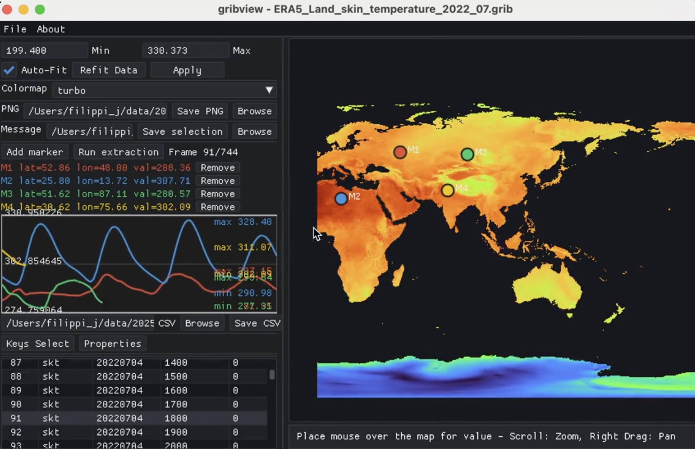

# gribview

A desktop GRIB viewer built with ECMWF ecCodes, SDL2 and OpenGL. Browse and sort
messages, inspect weather fields and metadata, export PNGs and CSV time series,
or save selected messages into a smaller GRIB file.



## Install

Get **1.4.0** from [GitHub Releases](https://github.com/filippi/gribview/releases/tag/v1.4.0).
Choose the app for your operating system, not the source archive.

### Mac: Apple Silicon, macOS 15 or newer

**Without Homebrew:** download the macOS ARM64 `.dmg`, open it, and drag
**Gribview.app** onto **Applications**. Open Gribview and drop a GRIB file onto
its window. The app includes its libraries and data; no compiler or Homebrew
installation is needed. Packages labeled `unsigned` may require
**System Settings > Privacy & Security > Open Anyway** on first launch.

**With Homebrew:** the CLI formula is available through the project tap:

```sh
brew install filippi/gribview/gribview
gribview your-file.grib
```

To install the desktop app instead:

```sh
brew install --cask filippi/gribview/gribview-app
```

Mac downloads are Apple Silicon only. There is no Intel or universal Mac build.

### Linux: x86_64 desktop

**Ubuntu 22.04+/Debian 12+:** download the `.deb`, then install it with your
software installer or:

```sh
sudo apt install ./gribview-1.4.0-Linux-x86_64.deb
```

Open **Gribview** from your applications menu.

**Other Linux desktops with glibc 2.35+:** download the `.AppImage`, mark it
executable in your file manager's permissions, then open it. From a terminal:

```sh
chmod +x Gribview-1.4.0-x86_64.AppImage
./Gribview-1.4.0-x86_64.AppImage
```

If AppImage mounting is unavailable, use the portable
`gribview-1.4.0-linux-x86_64.tar.gz` instead. Extract it and run `./gribview`
inside the extracted directory. Run `./install.sh` there to add it to your
applications menu without administrator privileges. The portable installer
uses Python 3, normally included on these desktops.

Linux requires a working graphical desktop and OpenGL 3.2. File dialogs use
zenity or kdialog; opening files by drag-and-drop or command-line arguments
also works. Alpine/musl Linux is not supported by these binary packages.

### Python environments

Platform wheels include the same native desktop application. The project index
selects the Apple Silicon macOS or x86_64 Linux wheel automatically:

```sh
python3 -m venv ~/.venvs/gribview
~/.venvs/gribview/bin/pip install --index-url https://filippi.github.io/gribview/wheels gribview
~/.venvs/gribview/bin/gribview your-file.grib
```

Alternatively, install a downloaded `.whl` with `pip install /path/to/file.whl`.
Python 3.9+ is required. These wheels use the project index, not PyPI, and still
need a graphical desktop to show the application.

### Windows

Download the Windows ZIP from Releases, extract it, and run `bin/gribview.exe`.
The CI workflow retains Windows packaging and bundles its runtime DLLs.

## Use

Launch the app and drag in a GRIB file, choose **File > Open**, or run:

```sh
gribview file1.grib file2.grib2
```

- Browse messages in the sortable table; Shift/Cmd/Ctrl selects multiple rows.
- Pan and zoom the map and choose a colour scale in the left panel.
- Inspect metadata, add markers and extract point/time-series CSV data.
- Save PNG images or export selected messages as a new GRIB.

A [sample GRIB](docs/sample.grib) is included with every new package.

## Build and test

macOS dependencies:

```sh
brew install cmake eccodes sdl2 glew libpng
```

Ubuntu/Debian dependencies:

```sh
sudo apt install build-essential cmake ninja-build libeccodes-dev libsdl2-dev libglew-dev libpng-dev
```

Then:

```sh
cmake -S . -B build -DCMAKE_BUILD_TYPE=Release
cmake --build build -j4
ctest --test-dir build --output-on-failure
./build/bin/gribview docs/sample.grib
```

`build/bin/gribview` is the freshly built executable. Other copies in
Applications, Homebrew or old `dist` directories are independent installations.
The About window and these commands identify the version, executable and data:

```sh
./build/bin/gribview --version
./build/bin/gribview --diagnostics
./build/bin/gribview --check docs/sample.grib
```

`--check` decodes the file without opening a window. A graphics smoke test is
available with `--smoke-test docs/sample.grib --screenshot build/smoke.png`.

See [packaging and release instructions](docs/packaging.md) for DMGs, AppImages,
Docker tests, Homebrew bottles, Python wheels, signing and publication.
